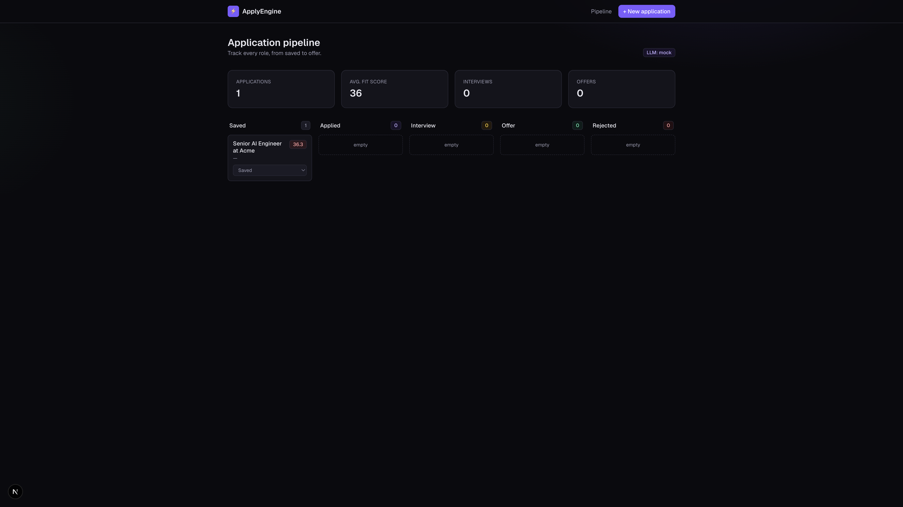
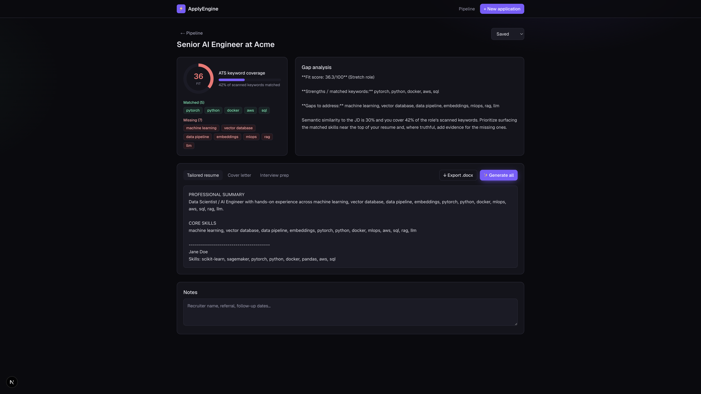
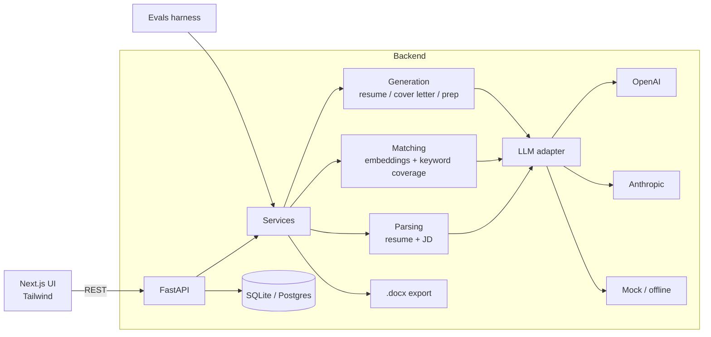
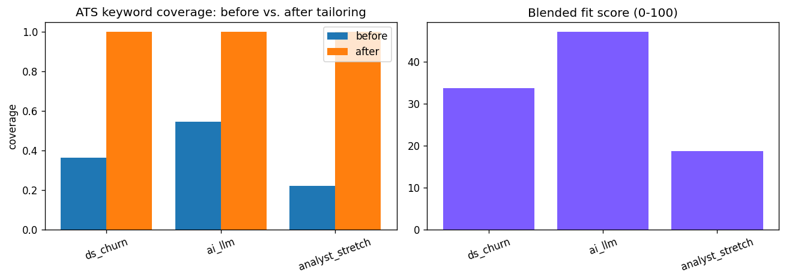

# ⚡ ApplyEngine

An **AI copilot for your job hunt**, built for Data Science / AI Engineer roles.
Sign in, paste your resume once, then drop in any job description to get:

- a **fit score** (semantic similarity + ATS keyword coverage),
- an honest **gap analysis**,
- a **tailored resume + cover letter** (exportable to `.docx`),
- **interview prep** questions with STAR outlines,
- a **Kanban tracker** for the whole pipeline,
- and an **AI career coach** you can talk to — it *remembers* what you tell it
  (a per-user memory store) and folds it into a stronger resume on demand.

Every account is private: profiles, jobs, applications, chat, and memory are all
scoped to the signed-in user, and sign-ups can be gated behind an invite code.

It's provider-agnostic (OpenAI / Anthropic / fully-offline mock) and ships with an
**evaluation harness** that measures whether tailoring actually improves keyword coverage.

> Built as a portfolio-grade project: the app itself demonstrates LLM orchestration,
> retrieval/embeddings, prompt hygiene, and evals — the exact skills an AI Engineer role screens for.

---

## Screenshots

**Pipeline board**



**Fit dashboard + generated materials**



---

## Architecture



**Design choices worth noting**

- **Assist, not blind auto-apply.** Generating tailored materials is 90% of the value
  without the brittleness/ToS issues of auto-submitting to job boards.
- **Provider-agnostic LLM layer** (`app/llm/`): swap OpenAI ↔ Anthropic ↔ offline with one env var.
- **Graceful degradation:** every AI service has a deterministic heuristic fallback, so the
  whole app (and the eval suite) runs end-to-end with **zero API keys**.
- **Versioned, centralized prompts** (`app/prompts.py`) instead of inline strings.

---

## Tech stack

| Layer | Tech |
|---|---|
| Frontend | Next.js (App Router), TypeScript, Tailwind v4 |
| Backend | FastAPI, SQLModel, Pydantic |
| AI | OpenAI / Anthropic SDKs, embeddings-based matching |
| Storage | SQLite (→ Postgres via `DATABASE_URL`) |
| Docs | python-docx, pypdf |
| Evals | pandas, matplotlib, Jupyter |

---

## Quickstart (local)

### 1. Backend

```bash
cd backend
python3 -m venv .venv && source .venv/bin/activate
pip install -r requirements.txt
cp .env.example .env        # optional: add OPENAI_API_KEY and set LLM_PROVIDER=openai
uvicorn app.main:app --reload --port 8000
```

Health check: <http://localhost:8000/api/health> · API docs: <http://localhost:8000/docs>

> With no keys it runs on the offline `mock` provider — fully usable for demos.

### 2. Frontend

```bash
cd frontend
npm install
npm run dev            # http://localhost:3000
```

`frontend/.env.local` points at the API (`NEXT_PUBLIC_API_URL=http://localhost:8000`).

### Or with Docker

```bash
docker compose up --build      # frontend :3000, backend :8000
```

---

## Evals

The tailoring pipeline is measured against (resume, JD) pairs for **keyword-coverage lift**
and **fit score**.

```bash
source backend/.venv/bin/activate
pip install -r evals/requirements.txt
python evals/run_evals.py          # prints a table + writes results.json
jupyter notebook evals/evals.ipynb # charts version
```



Sample run (offline mock provider):

```
case                kw  cov_before  cov_after    lift    fit  parse
ds_churn            11       0.364        1.0  +0.636   33.7   True
ai_llm              11       0.545        1.0  +0.455   47.1   True
analyst_stretch      9       0.222        1.0  +0.778   18.7   True
AVG                                       +0.623   33.2   100%
```

---

## Project layout

```
applyengine/
├── backend/
│   └── app/
│       ├── llm/            # provider-agnostic LLM adapters (openai/anthropic/mock)
│       ├── routers/        # auth, profiles, jobs, applications, generate, chat
│       ├── services/       # parsing, matching, generation, doc export, coach
│       ├── auth.py         # JWT + PBKDF2 password hashing
│       ├── prompts.py      # versioned prompts (incl. coach + memory extraction)
│       ├── models.py       # SQLModel tables (User, Profile, Job, Application, ChatMessage, Memory)
│       └── main.py
├── frontend/               # Next.js app (login, pipeline, intake, detail, coach)
├── evals/                  # eval harness + notebook
└── docker-compose.yml
```

---

## API surface

All endpoints below (except auth) require a `Bearer` token from login/register.

| Method | Path | Purpose |
|---|---|---|
| POST | `/api/auth/register` / `/api/auth/login` | Create account / sign in → JWT |
| GET | `/api/auth/me` | Current user |
| POST | `/api/chat/messages` | Talk to the coach (learns durable facts) |
| GET | `/api/chat/messages` / `/api/chat/memories` | Conversation history / learned memory |
| POST | `/api/chat/apply-to-resume` | Rebuild the profile from learned memory |
| POST | `/api/profiles` / `/api/profiles/upload` | Create profile from text / file |
| POST | `/api/jobs` | Parse a job description |
| POST | `/api/applications` | Create application + compute fit |
| POST | `/api/generate` | Generate resume / cover letter / prep |
| PATCH | `/api/applications/{id}/status` | Move pipeline stage |
| GET | `/api/applications/{id}/export/{doc}` | Download `.docx` |

---

## Deploy

- **Backend** → Render (see `render.yaml`) or any Docker host.
- **Frontend** → Vercel; set `NEXT_PUBLIC_API_URL` to the deployed API URL and add that
  origin to the backend's `CORS_ORIGINS`.

---

## Auth & the coach

- **Auth:** JWT bearer tokens; passwords hashed with PBKDF2 (stdlib, no native build).
  Set `JWT_SECRET` and (optionally) `SIGNUP_CODE` to gate registrations.
- **Coach:** each chat turn is answered by the LLM *and* mined for durable facts
  (skills, achievements, goals, preferences) stored per-user. "Update my resume"
  rebuilds your profile from those facts, which then feeds the tailoring pipeline.
- **Persistence:** use a real `DATABASE_URL` (Postgres) in production so accounts and
  memory survive redeploys — SQLite on ephemeral hosts resets on every deploy.

## Roadmap

- [ ] RAG over your project history so cover letters cite real work
- [ ] Optional Playwright autofill (human submits)
- [ ] Response-rate analytics by fit-score bucket
- [x] Auth + multi-user
- [x] Conversational coach with long-term memory
